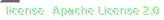

= DevTools

image:Documents/svg/test.svg[test]

image:Documents/svg/build.svg[build]

标准开发工具包。

== 开发文档

项目规范文档列表（开发前请阅读）：

- link:Documents/codestyle.adoc[代码规范文档]
- link:Documents/commit-style.adoc[提交规范文档]

== 构建环境要求

此项目使用 Maven toolchains 进行构建操作，JDK要求1.8及以上，JDK版本最低要求 1.8。

* link:https://openjdk.org/projects/jdk/21/[OpenJDK]
* link:https://www.oracle.com/java/technologies/javase/jdk21-archive-downloads.html[Oracle OpenJDK]
* link:https://aws.amazon.com/cn/corretto/?filtered-posts.sort-by=item.additionalFields.createdDate&filtered-posts.sort-order=desc[Aws Corretto]
* link:https://github.com/dragonwell-project/dragonwell21[Alibaba Dragonwell]

=== 构建

本项目使用 Maven 进行构建，你需要在你本地的环境变量中添加 Maven 的 `/bin` 目录地址，并指定 Maven Home

    MAVEN_HOME=<your maven home>

相信如何添加环境变量对于任何一个程序员来说都是最基础的操作这里就不再过多的赘述。

在终端上执行 `mvn clean package` 对项目进行构建。

== Maven Central

项目的依赖包已经上传到了 Maven Central，你可以在任意项目中直接引入依赖。

[source,xml]
----
<dependency>
    <groupId>io.github.redgogh</groupId>
    <artifactId>devtools</artifactId>
    <version>2.1.1</version>
</dependency>
----

== License

本项目采用 Apache License 2.0 许可证，详情见 link:LICENSE[LICENSE]